**Lec1: Introduction**\
cs231n focus: image classification\
\
**Lec2: Image classification pipeline** \
如何分类？\
1.KNN缺点：1) fast in training, slow in inference
     2) dimensionality curse\
2.linear classifier: score = f(W, x)\
\
**Lec3: Loss Functions and Optimization**\
1.**Multiclass SVM loss** [SVM之Hinge Loss解释][1]
$$\begin{aligned}
  L_i &=\sum_{j\neq y_i} 
\begin{cases}
  0 & if  s_{y_i}\ge s_j+1\\
  s_j-s_{y_i}+1 & otherwise
\end{cases} \\
&=\sum_{j\neq y_i}max(0, s_j-s_{y_i}+1)
\end{aligned}
$$

2.**Regularization**\
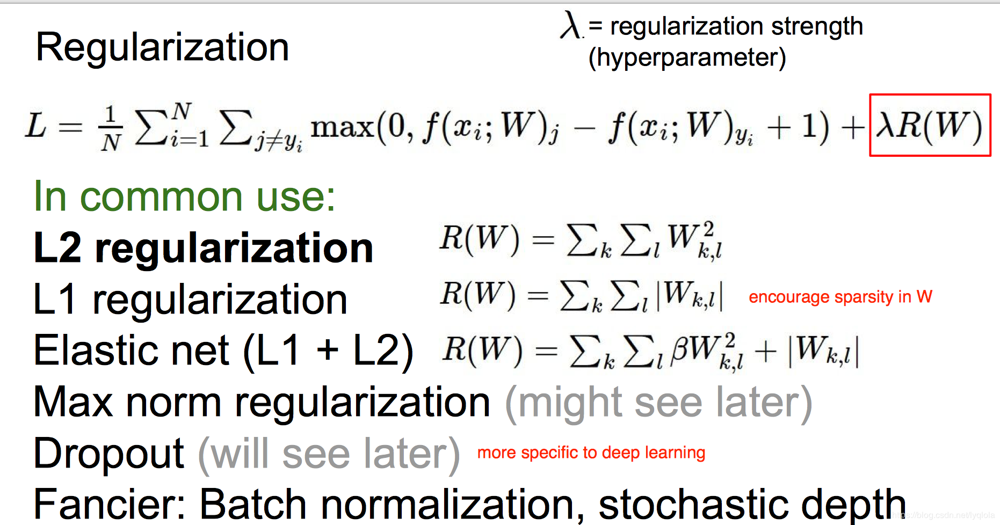 \
\
3.**Softmax Classifier** (Multinomial Logistic Regression)\
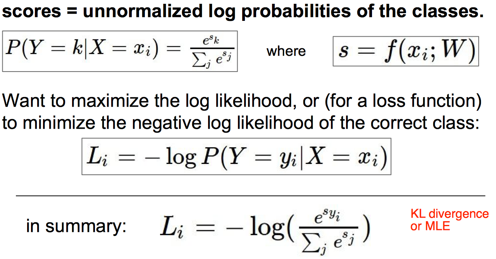
\
4.**Softmax vs. SVM** \
[Support Vector Machine vs Logistic Regression][2]
\
[Logistic Loss ](http://www.hongliangjie.com/wp-content/uploads/2011/10/logistic.pdf)

[1]: https://www.cnblogs.com/guoyaohua/p/9436237.html
[2]:https://towardsdatascience.com/support-vector-machine-vs-logistic-regression-94cc2975433f
\
**Lec4: Backpropagation and Neural Networks**\
1.Backpropagation chain rule: [local gradient] x [upstream gradient]
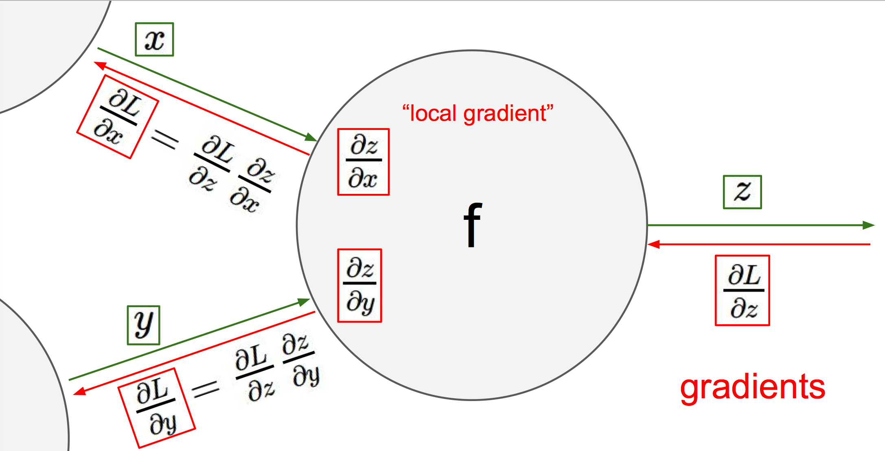 \
add gate: gradient distributor\
max gate: gradient router\
mul gate: gradient switcher\
Gradients add at branches

2.Gradients for vectorized code: [Jacobian matrix][3] \
 \
!!Always check: The gradient with respect to a variable should have the same shape as the variable

[3]: https://en.wikipedia.org/wiki/Jacobian_matrix_and_determinant

\
**Lec5: Convolutional Neural Networks**\
1.**convolution layer**: Use convolutional layers to preserve 
the spatial structure
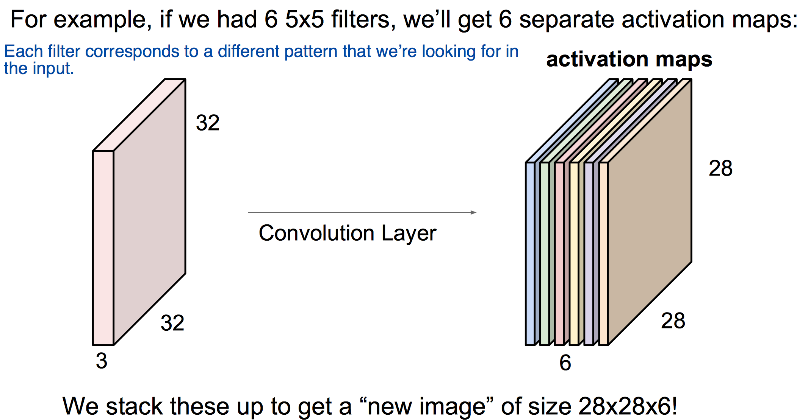 \
ConvNet is a sequence of Convolutional Layers, interspersed with activation functions(eg.ReLu).
filter: receptive field.\

2.**pooling layer**(没有引入参数)

- max pooling:
 

3.**Summary**
- ConvNets stack CONV,POOL,FC layers
- Trend towards smaller filters and deeper architectures
- Trend towards getting rid of POOL/FC layers (just CONV)
- Typical architectures look like [(CONV-RELU)*N-POOL?]*M-(FC-RELU)*K,SOFTMAX where N is usually up to ~5, M is large, 0 <= K <= 2.
- but recent advances such as ResNet/GoogLeNet challenge this paradigm

\
**Lec 6: Training Neural Networks(I)**\
**Overview**\
1)One time setup\
 activation functions, preprocessing, weight initialization, regularization, gradient checking
\
2)Training dynamics \
babysitting the learning process, parameter updates, hyperparameter optimization
\
3)Evaluation\
 model ensembles

1.**Activation Functions** \
 \
(1)**sigmoid函数**\
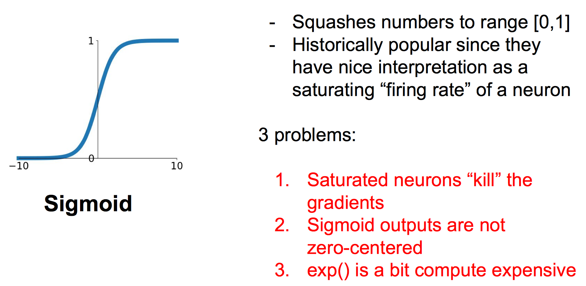 \
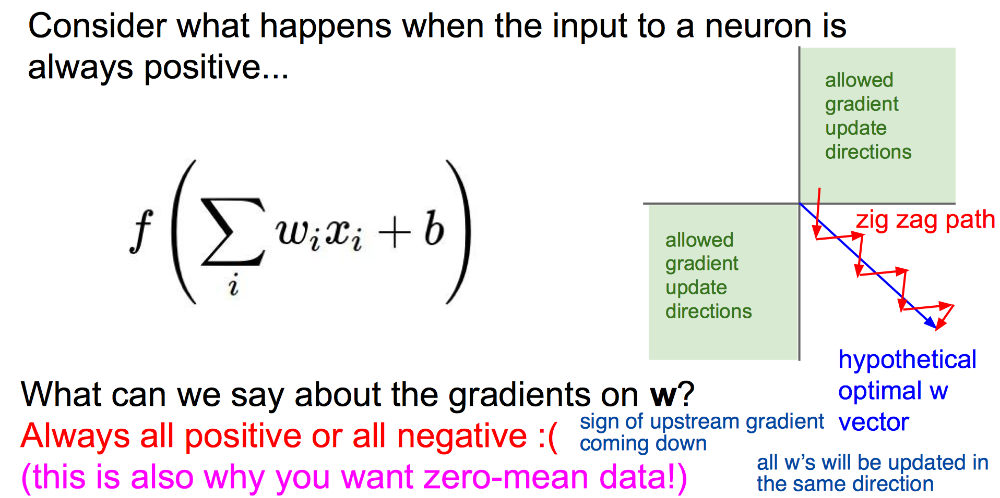 \
(2)**tanh函数**\
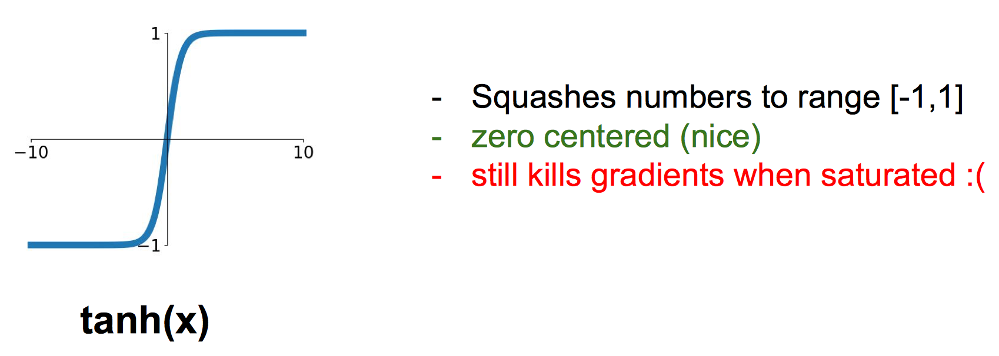 \
(3)**ReLU函数**\
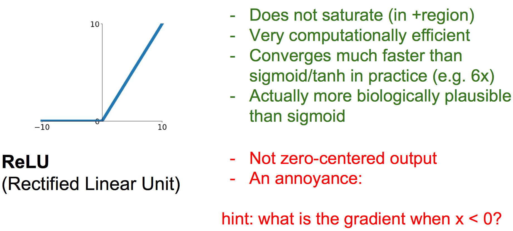 \
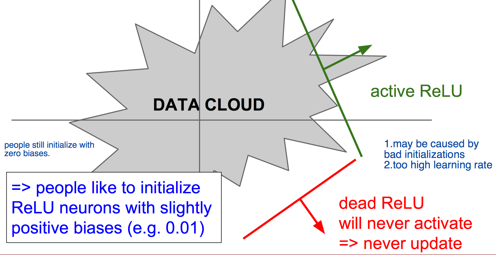 \
(4)**Leaky ReLU函数**\
 \
(5)**ELU函数**\
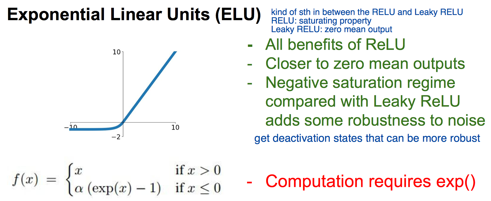

(6)**Maxout “Neuron”** [Goodfellow et al., 2013]\
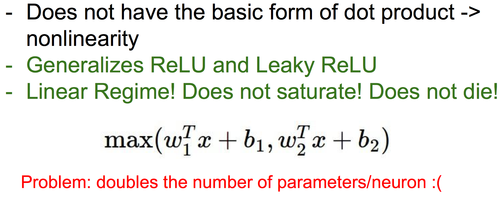

**In practice:**
- Use ReLU. Be careful with your learning rates
- Try out Leaky ReLU / Maxout / ELU
- Try out tanh but don’t expect much
- Don’t use sigmoid

2.**Data Preprocessing**\
\

3.**Weight Initialization**\
(1) ``W=0``\
All the neurons will do the same thing, have same operation on top of the inputs, output the same thing, get same the same gradient and update in the same way.\
However what we want is that neurons do different things. So initialize everything equally is no symmetry breaking.\
(2) Small random numbers (eg.gaussian with zero mean and 1e-2 standard deviation)\
``W = np.random.randn(fan_in, fan_out) * 0.01``\
Works ~okay for small networks, but problems with deeper networks: All activations become zero(因为不断乘以由小的随机数构成的W)! Think about the backward pass for a W*X gate, because X’s are very small(around zero), we get the same problem of gradients being too small and no update.\
(3) Big random numbers (eg.gaussian with zero mean and 1 standard deviation)\
``W = np.random.randn(fan_in, fan_out) * 1.0``\
Almost all neurons completely saturated, either -1 and 1. Gradients will be all zero.\
(4) Xavier initialization\
``W = np.random.randn(fan_in, fan_out) / np.sqrt(fan_in)``\
Want: variance of the input to be the same as variance of the output\
(5) for ReLU neurons\
``W = np.random.randn(fan_in, fan_out) * sqrt(2.0/fan_in)``

4.**Batch Normalization**\
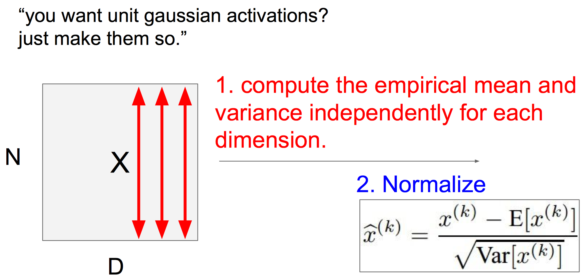\
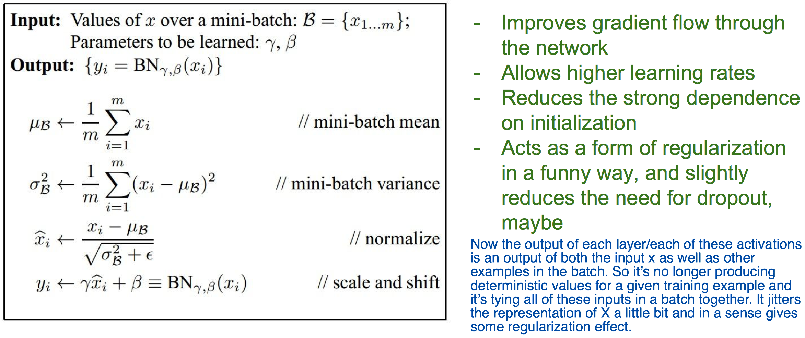\
*Note*: 
- BatchNorm layer usually inserted after Fully Connected or Convolutional layers, and before nonlinearity.
- At test time BatchNorm layer functions differently:
The mean/std are not computed based on the batch. Instead, a single fixed empirical mean of activations during training is used.
(e.g. can be estimated during training with running averages)

5.**Babysitting the Learning Process**\
**Step 1: Preprocess the data**\
**Step 2: Choose the architecture**\
-Double check that the loss is reasonable\
**Step 3: Start to train**\
-Make sure that you can overfit very small portion of the training data\
-Start with small regularization and find learning rate that makes the loss go down:\
*loss not going down*: learning rate too low\
*loss exploding*: learning rate too high. cost: NaN almost always means high learning rate...\
-Rough range for learning rate we should be cross-validating is somewhere [1e-3 … 1e-5]

6.**Hyperparameter Optimization**\
(1)**Cross-validation strategy**\
**coarse -> fine** cross-validation in stages\
**First stage**: only a few epochs to get rough idea of what params work\
**Second stage**: longer running time, finer search … (repeat as necessary)
*Tip for detecting explosions in the solver:
If the cost is ever > 3 * original cost, break out early*\
(2)**Random Search vs. Grid Search**\
(3)**Hyperparameters to play with**:\
  -network architecture\
  -learning rate, its decay schedule, update type\
  -regularization (L2/Dropout strength)

7.**Summary**
- Activation Functions (use ReLU)
- Data Preprocessing (images: subtract mean)
- Weight Initialization (use Xavier init)
- Batch Normalization (use)
- Babysitting the Learning process
- Hyperparameter Optimization
(random sample hyperparams, in log space when appropriate)

**Lec 7: Training Neural Networks(II)**\
**I.Optimization**\
1.**Problems with SGD**\
1.1.**Poor Conditioning**\
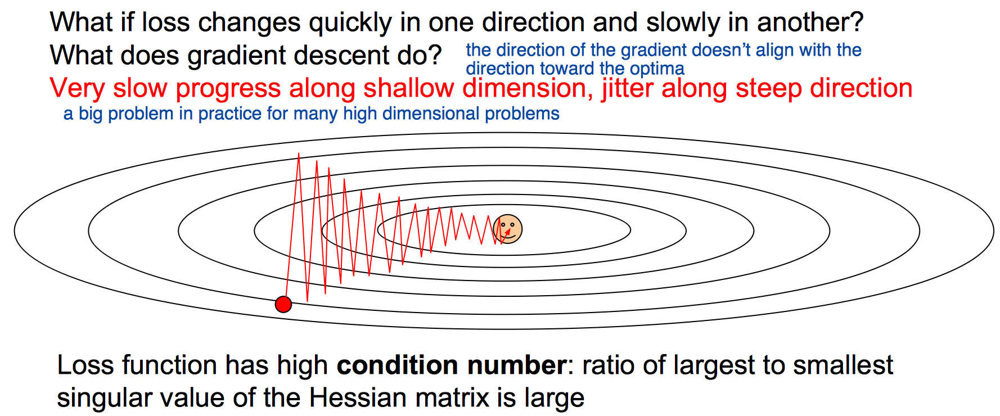\
1.2.**Local Optima**\
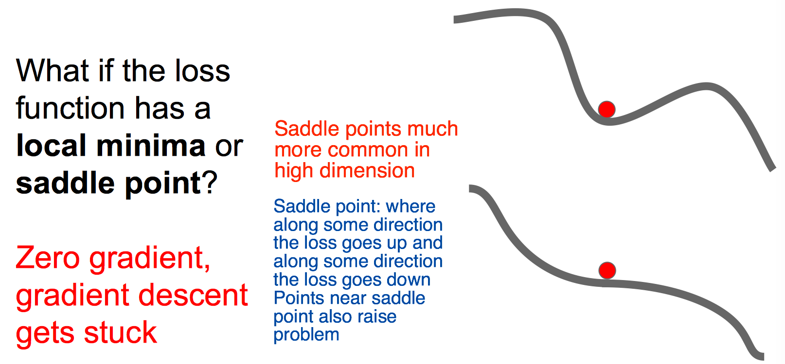\
1.3.**Gradient Noise**\
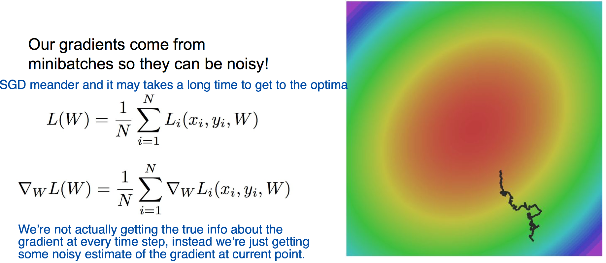

2.**SGD + Momentum**\
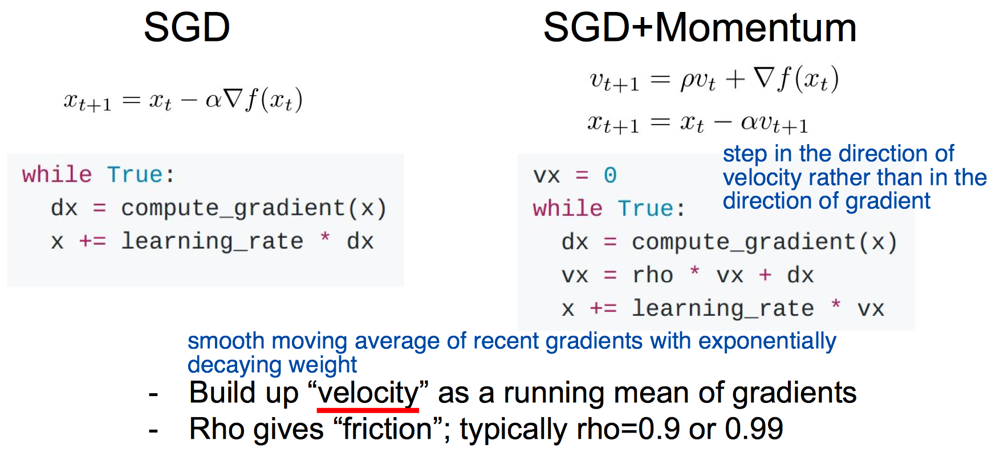\
**Nesterov Momentum**\
\
**Q**: sgd+momentum may overshoot and in some cases it will come back to the minima, but what if it's a sharp minima? will sgd+momentum miss the minima?\
**A**: the idea of some recent theoretical work is that the sharp minima is bad minima and we dont even want to land into those minima. the sharp minima may be the minima that overfits more. Imagine we double the dataset and the whole optimization landscape would change and those sharp minima may disappear. Flat minima is more robust as we change the training data, hence generalize better to test data. so it's actually a feature rather than a bug that SGD+momentum skips over the sharp minima.

3.**AdaGrad && RMSProp**\
**AdaGrad features**\
(1) When the loss func has high condition number, AdaGrad has the nice property of accelerating movement along one dimension and slowing down movement along the wiggling dimension.\
(2) Step size gets smaller since the grad_squared term gets larger, may get stuck before reaching the minima, so not commonly used in practice.\
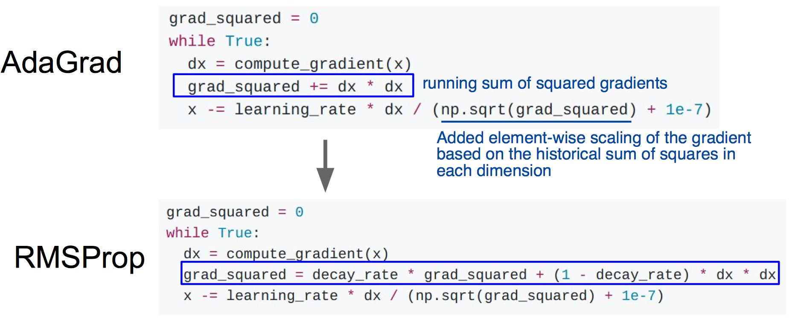

4.**Adam**\
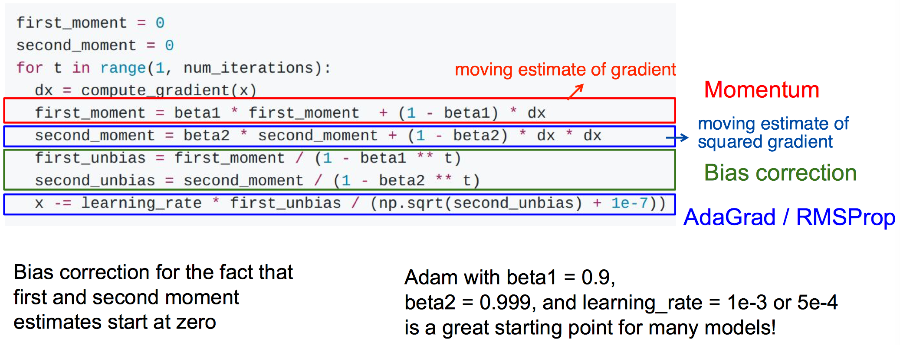

5.**Learning rate**\

6.**Second-Order Optimization**\
second-order Taylor expansion:
$$J(\theta)\approx J(\theta_0)+(\theta - \theta_0)^T\nabla _{\theta}J(\theta_0)+\frac{1}{2}(\theta - \theta_0)^T H(\theta - \theta_0)$$
Solving for the critical point we obtain the **Newton parameter update**:
$$ \theta^*=\theta_0-H^{-1}\nabla _{\theta}J(\theta_0) $$
Pro: No hyperparameters! No learning rate!\
Con: Hessian has O(N^2) elements Inverting takes O(N^3) N = (Tens or Hundreds of) Millions

**Quasi-Newton methods** (BGFS most popular):
instead of inverting the Hessian (O(n^3)), approximate inverse Hessian with rank 1 updates over time (O(n^2) each).\
**L-BFGS** (Limited memory BFGS): Does not form/store the full inverse Hessian.\
-Does not work well for non-convex problems.\
-Usually works very well in *full batch, deterministic mode/little stochasticity* i.e. if you have a single, deterministic f(x) then L-BFGS will probably work very nicely\
-Does not transfer very well to mini-batch setting. Gives bad results. Adapting L-BFGS to large-scale, stochastic setting is an active area of research.

7.**In practice**
- Adam is a good default choice in most cases
- If you can afford to do full batch updates then try out L-BFGS (and don’t forget to disable all sources of noise)

**II.Model Ensembles**\
1.**Steps**:\
(1)Train multiple independent models. \
(2)At test time average their results\
2.**Tips and Tricks**\
(1)Instead of training independent models, use multiple snapshots of a single model during training! [SGDR](https://arxiv.org/pdf/1608.03983.pdf)\
(2)Instead of using actual parameter vector, keep a moving average of the parameter vector and use that at test time. [Polyak averaging](http://www.meyn.ece.ufl.edu/archive/spm_files/Courses/ECE555-2011/555media/poljud92.pdf)

**III.Regularization** 
*How to improve single-model performance? [check slides]*\
1.**Add term to loss** *check Lec3*\
2.**Dropout** *check slides*\
3.**Data Augmentation**\
(1)Horizontal Flips\
(2)Random crops and scales\
(3)Color Jitter: Randomize contrast and brightness\
4.**DropConnect**\
Instead of zeroing out the activations at every
forward pass, we randomly zero out some of the values of the weight matrix.\
5.**Stochastic Depth**\
randomly drop layers from the network during training\
6.**Regularization: A common pattern**\
**Training**: Add random noise\
**Testing**: Marginalize over the noise

**IV.Transfer Learning**\
1.**Transfer Learning with CNNs**\
\
\
2.**Transfer Learning with CNNs is pervasive**: use CNN pretrained on ImageNet and fine tune it or reinitialize part of it for task at hand\

3.Deep learning frameworks provide a **“Model Zoo” of pretrained models** so you don’t need to train your own\
Caffe: https://github.com/BVLC/caffe/wiki/Model-Zoo \
TensorFlow: https://github.com/tensorflow/models \
 PyTorch: https://github.com/pytorch/vision

**Lec 8: Deep Learning Software** *check slides*\
1.**Deep Learning framework**
- Theano / TensorFlow
- Torch / PyTorch
- Caffe / Caffe2
  
2.**Static vs Dynamic Graphs**

**Lec 9: CNN Architectures**\
1.**Case Studies**
- AlexNet
- VGG
- GoogLeNet
- ResNet
  
**AlexNet**是将CNN成功用于视觉任务的第一个模型；\
**VGG和GoogLeNet**都诞生于Batch Normalization之前，因此都为了使deeper model收敛而额外做了工作，比如说VGG一开始是训练了11层，之后再随机地增加其他层不断调参得到最终的模型；GoogLeNet则在网络低层增加了auxiliary classifier，不是为了辅助分类，而是为了向网络低层注入梯度。\
**ResNet**的Residual block起到两个作用：\
(1)如果将Residual block中的参数都置为0，则这个Residual block就实现了一个identity mapping。因此可以在ResNet中加入l2 norm，因为加上参数的l2 norm会使参数趋于0，在常规的神经网络中，使参数趋于0并不make sense，但在ResNet中，就可以使模型习得有哪些层是不需要的，by driving the Residual block to identity mapping\
(2)gradient highway for the gradient to flow backward through the entire network

**NOTE: Managing gradient flow is important in DL/ML**

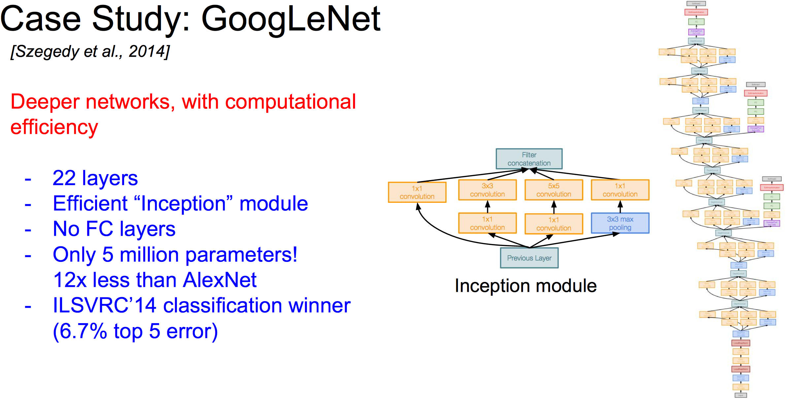
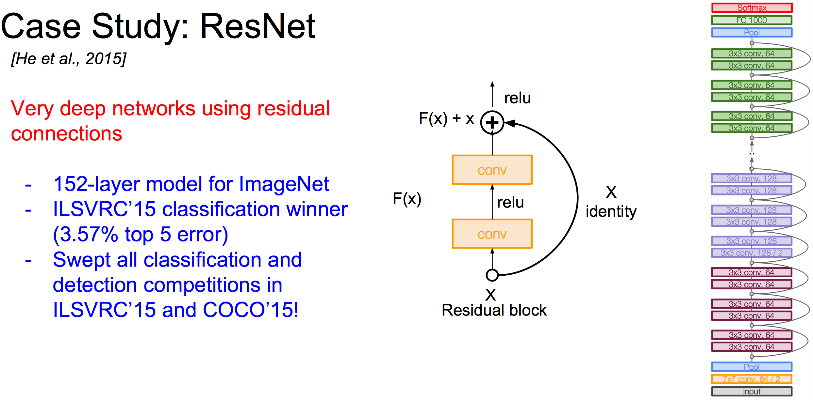

2.**最新模型**
- DenseNet
- FractalNet

**Lec 10: RNN**\
1.**Recurrence formula**:
$$
h_t=f_W(h_{t-1}, x_t)\\
h_t:\text{new state}\\
h_{t-1}:\text{old state}\\
x_t: \text{input}
$$
Eg. 
$$h_t=tanh(W_{hh}h_{t-1}+W_{xh}x_t)\\
y=W_{hy}h_t$$
Notice: the same function and the same set
of parameters W are used at every time step.

2.**Two ways to show RNN**\
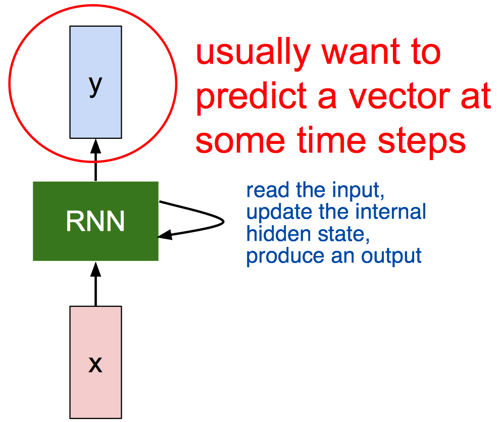
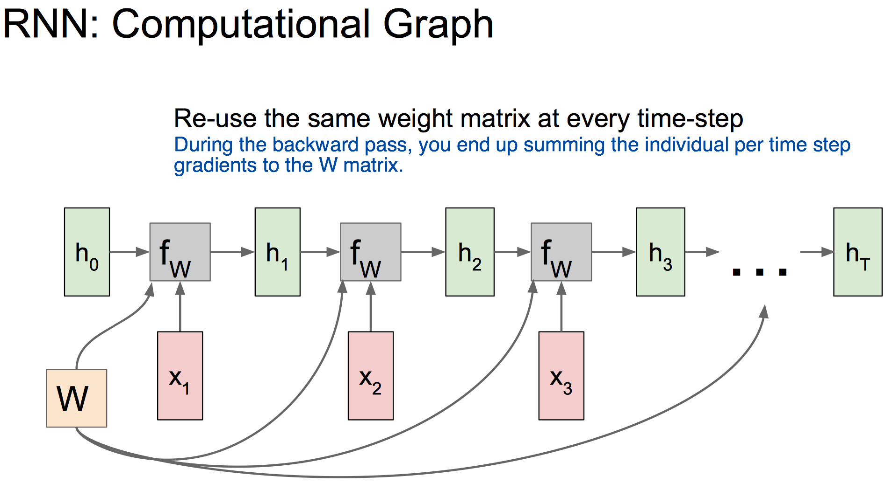

3.**Truncated Backpropagation through time**\
SGD in the case of sequence

4.**Multilayer RNNs**
$$h_t^l=tanh \ W^l(\ 
  \begin{matrix}
  h_t^{l-1}\\
  h_{t-1}^l
  \end{matrix}
  ), \ h\in\mathbb{R}^n, \ W^l\ [n\times 2n] $$
RNN模型的层数不会很深，一般2~4层

5.**Vanilla RNN Gradient Flow**\

$$\text{Backpropagation from }h_t \text{to } h_{t-1} \text{multiplies by }W \text{(actually }W_{hh}^T )$$
Computing gradient of h0 involves many factors of W (and repeated tanh)\
Largest singular value of W > 1: **Exploding gradients** -> **Gradient clipping**: Scale gradient if its norm is too big\
Largest singular value of W < 1: **Vanishing gradients** -> Change RNN architecture

6.**Long Short Term Memory (LSTM)**\
*针对上述vanilla RNN会遇到的梯度爆炸和梯度消失问题提出的解决方案*

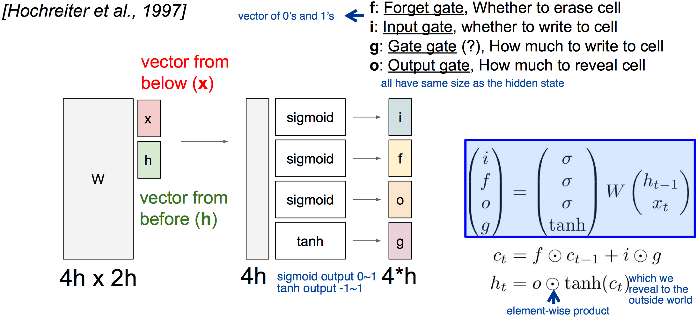
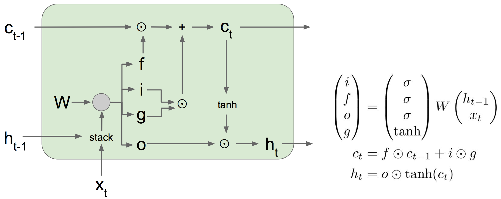
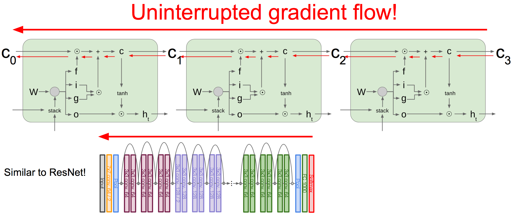

**LSTM相较于vanilla RNN的优点**：
1. only elementwise multiplication by f, better than full matrix multiplication by W
2. element-wise multiplication will potentially be multiplying by a different forget gate f at every time step
3. f来自于sigmoid函数，因此element-wise mult是乘以0~1之间的数，这带来更好的numerical properties
4. To backpropagate from the final hidden state to the first cell state, then through that backward path, we only backpropagate through a single tanh non linearity rather than through a separate tanh at every time step.
5. Local gradient on W will be coming through these gradients on c and h. Because we’re maintaining these gradients on c much more nicely in the LSTM case, those local gradient on W at each time step will also be carried forward and backward through time much more cleanly.

**Lec 11: Detection and Segmentation**\
I.**Semantic Segmentation**\
1.**FCN**: Design a network as a bunch of convolutional layers to make predictions for pixels all at once!\
2.**Problem**: convolutions at original image resolution will be computationally expensive and take a lot of memory\
3.**Solution**: Design network as a bunch of convolutional layers, with downsampling and upsampling inside the network!\
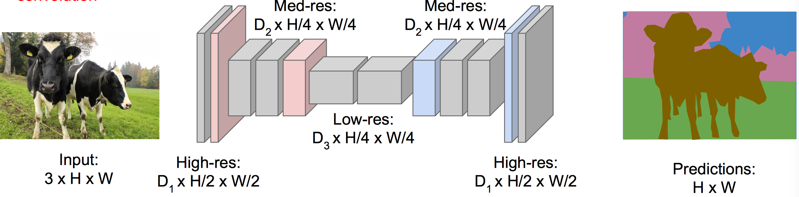

4.**In-Network upsampling**\
(1)**Unpooling**\
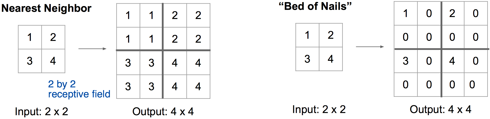

(2)**Max Unpooling**\
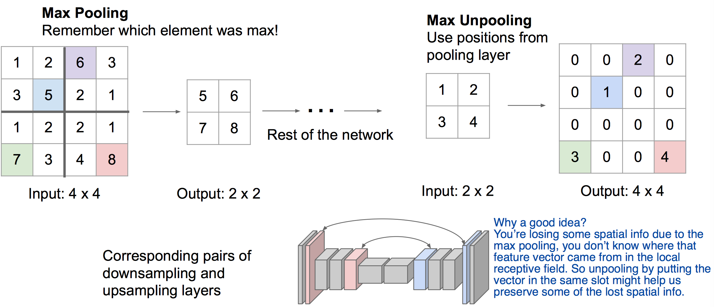

(3)**Transpose Convolution**\
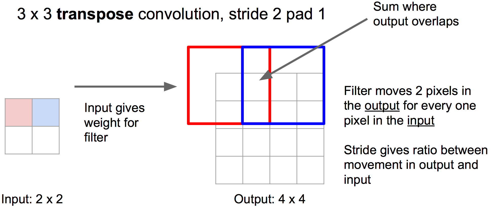